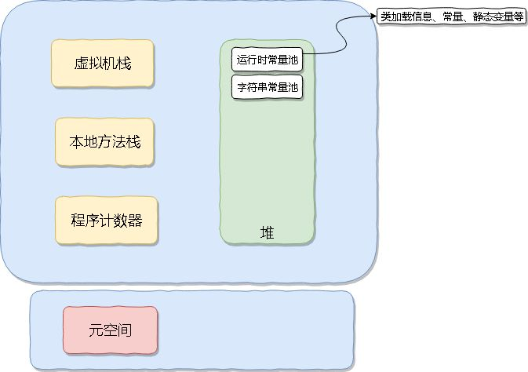

# jvm内存

> jdk8

在 Java 8 里面不存在永久代了，取而代之的是元空间。

## 元空间

元空间是保存元数据的地方

>元数据：描述数据的数据
>例如一部电影，导演：---、主演：---、投资方：---，这些信息中的导演、主演、投资方就叫元数据，他们加一起描述了整部电影的详细数据

那么在元空间里面保存的就是类的元数据，如方法、字段、类、包的描述信息，这些信息可以用于创建文档、跟踪代码中的依赖性、执行编译时检查

### 元空间存在的意义

在方法区里面，由于方法区大小是启动时就设置好的，可以用默认的也可以手动指定： -XX:MaxPermSize ，但是他始终还是有限定大小的（触发永久代 OOM 后该大小会动态调整），也就是说会发生 OOM

此外永久代的 GC 特别难搞，严重影响 Full GC 的性能。于是抛弃永久代，使用元空间，从而解决这些问题

### 元空间如何提高性能

* 永久代里面的常量池都移到堆里面，只保存元数据，从而让 Full GC 不再关心方法区
* 元空间使用直接内存，理论上系统内存有多大，元空间就可以有多大，不存在 OOM
* 元空间有单独的元空间虚拟机执行内存分配与垃圾回收

### 元空间工作流程

虽然元空间在本地内存中，但是还是可以通过：`-XX:MetaspaceSize` 来控制它的初始大小，达到该值就会触发垃圾收集进行类型卸载

同时 GC 时会对该值进行调整：如果释放了大量的空间，就适当降低该值；如果释放了很少的空间，那么在不超过 `MaxMetaspaceSize` 时，适当提高该值。

类加载器存储的位置就是元空间，每一个类加载器的存储区域都称作一个元空间，所有的元空间合在一起就是我们一直说的元空间。当一个类加载器被垃圾回收器标记为不再存活，其对应的元空间会被回收。

### 元空间的内存分配

由元空间虚拟机负责，采用的形式为：组块分配。

元空间虚拟机维护着一个全局的空闲组块列表，当一个类加载器需要元空间内存的时候就从这里面找一块，用完后再释放。类加载器维护的这个组块又分为多个小块，每一块存储一个单元的元信息，分配方式为指针碰撞法。

存在的问题：由于元空间的内存分配值组块方式的，所以存在内存碎片问题（目前不支持压缩）